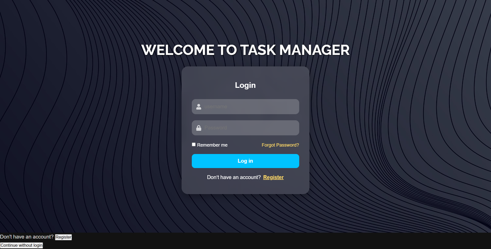

# 🧩 TaskZone — Task Manager App

TaskZone is a robust, full-stack Task Management application designed to help users organize their daily activities efficiently. Built with **Spring Boot** for the backend and **React.js** for the frontend, it offers a seamless and responsive user experience with secure authentication and real-time task updates.

---

## 📸 App Screenshots

| **Login Screen** | **Register Screen** |
|:---:|:---:|
|  |  |

### **Dashboard & Task Overview**


---

## 🚀 Features

- **🔐 Secure Authentication**: User registration and login powered by JWT (JSON Web Tokens).
- **📝 Task Management**: Create, Read, Update, and Delete (CRUD) tasks effortlessly.
- **✅ Status Tracking**: Mark tasks as Pending, In Progress, or Completed.
- **📊 Visual Analytics**: Interactive charts to visualize task distribution and progress.
- **📱 Fully Responsive**: Optimized for desktops, tablets, and mobile devices.
- **🎨 Modern UI**: Clean and intuitive interface built with React and CSS.

---

## 🧱 Tech Stack

| **Category** | **Technologies** |
| :--- | :--- |
| **Frontend** | React.js, Axios, CSS3, Chart.js |
| **Backend** | Java, Spring Boot, Spring Security, JWT |
| **Database** | MySQL / H2 Database, Hibernate (JPA) |
| **Tools** | Maven, npm, Git |

---

## 🛠️ Getting Started

Follow these instructions to set up the project locally.

### Prerequisites
- **Java JDK 17+**
- **Node.js & npm**
- **MySQL** (if using MySQL instead of H2)

### 1️⃣ Backend Setup (Spring Boot)

1. Navigate to the backend directory:
   ```bash
   cd backend/task-m
   ```
2. Configure the database in `src/main/resources/application.properties` (if needed).
3. Run the application:
   ```bash
   ./mvnw spring-boot:run
   ```
   The backend server will start on `http://localhost:8080`.

### 2️⃣ Frontend Setup (React)

1. Navigate to the frontend directory:
   ```bash
   cd frontend/task-manager-frontend
   ```
2. Install dependencies:
   ```bash
   npm install
   ```
3. Start the development server:
   ```bash
   npm start
   ```
   The application will open at `http://localhost:3000`.

---

## 📂 Project Structure

```
task-manager-app/
├── backend/             # Spring Boot Application
│   └── task-m/
│       ├── src/
│       └── pom.xml
├── frontend/            # React Application
│   └── task-manager-frontend/
│       ├── src/
│       └── package.json
├── screenshots/         # App Preview Images
└── README.md            # Project Documentation
```

---

## 🤝 Contributing

Contributions are welcome! Please fork the repository and submit a pull request.

---

## 📄 License

This project is licensed under the MIT License.
